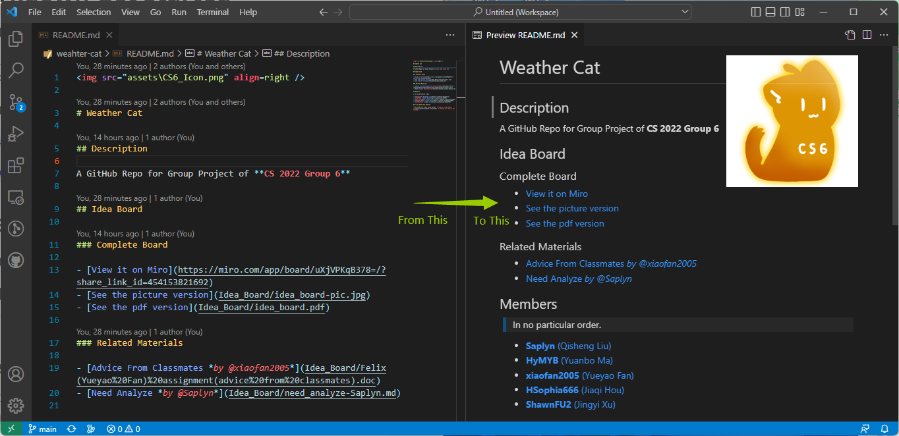

# #️⃣ Markdown Get Started

> [back to repo README](../README.md)

## #️⃣ What's Markdown

In short, **Markdown** is a lightweight markup language for creating formatted text using a plain-text editor.



---

## #️⃣ Headline (Syntax)

```markdown
# Heading level 1
## Heading level 2
### Heading level 3
```

# Heading level 1
## Heading level 2
### Heading level 3

---

## #️⃣ Paragraphs (Syntax)

```markdown
This is a paragraph. You can write your words here.

This is another paragraph. Make sure there's an empty line between paragraphs.
If not, it will be considered as one paragraph.
```

This is a paragraph. You can write your words here.

This is another paragraph. Make sure there's an empty line between paragraphs.
If not, it will be considered as one paragraph.

---

## #️⃣ Emphasis (Syntax)

```markdown
Make you words **Bold**.

Or make it *Italic*.

If you want, it can be ***Both***.

**Multiple Words** are also supported.
```

Make you words **Bold**.

Or make it *Italic*

If you want, it can be ***Both***

**Multiple Words** are also supported.

---

## #️⃣ Strikethrough (Syntax)

```markdown
I didn't finish my homework, ~~because I was too lazy to do it.~~
```

I didn't finish my homework, ~~because I was too lazy to do it.~~

---

## #️⃣ Lists (Syntax)

```markdown
- This is an unordered list
- Every line starts with a '-'
- Note that there must be an Empty Space between '-' and your words

1. This is an ordered list
1. Every line starts with "1."
1. Also, there must be an Empty Space between "1." and your words
1. Don't worry, the order will render automatically
```

- This is an unordered list
- Every line starts with a '-'
- Note that there must be an Empty Space between '-' and your words

1. This is an ordered list
1.  Every line starts with "1."
1. Also, there must be an Empty Space between "1." and your words
1. Don't worry, the order will render automatically

---

## #️⃣ Links (Syntax)

```markdown
This is a [Hyperlink](https://www.baidu.com/) that links to Baidu.
```

This is a [Hyperlink](https://www.baidu.com/) that links to Baidu.

---

## #️⃣ Images (Syntax)

```markdown
Look! A picture!


```

Look! A picture!


---

## #️⃣ Fenced Code Blocks (Syntax)

````markdown
Here comes the Codes~

```c
#include <stdio.h>
int main() {
    printf("Hello there~\n");
}
```
````

Here comes the Codes~

```c
#include <stdio.h>
int main() {
    printf("Hello there~\n");
}
```

---

## #️⃣ References

- [Markdown - Wikipedia](https://en.wikipedia.org/wiki/Markdown)
- [Basic Syntax | Markdown Guide](https://www.markdownguide.org/basic-syntax/)
- [Extended Syntax | Markdown Guide](https://www.markdownguide.org/extended-syntax/)

## #️⃣ See Also

- [Markdown Cheat Sheet | Markdown Guide](https://www.markdownguide.org/cheat-sheet/)
